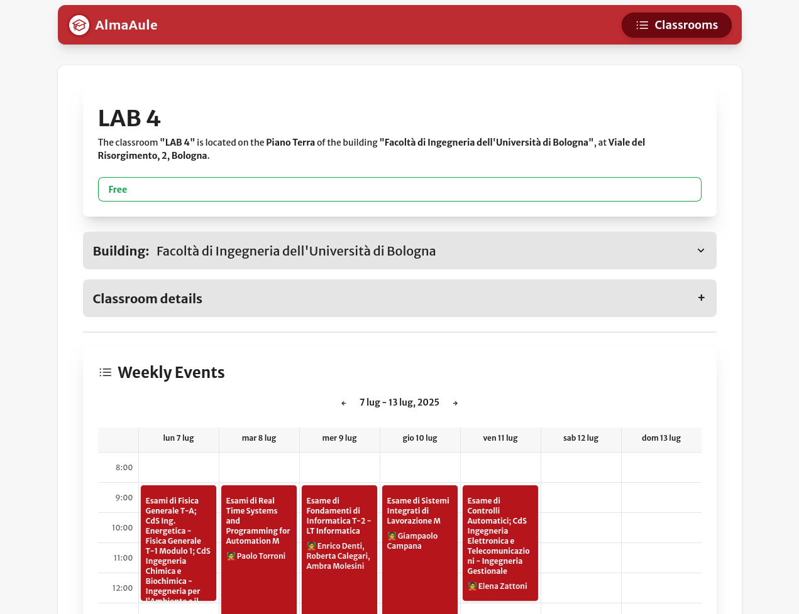

# AlmaAule - Open Source Web App for Unibo Room Schedules

AlmaAule is a free and open source web application that helps users check classroom availability at the University of Bologna.

With AlmaAule, you can search for rooms, view their schedules, and see their current occupancy status.

## Disclaimer

In no way is this project affiliated with or endorsed by the University of Bologna (Unibo). It is an independent project created by students and developers to provide a useful tool for the Unibo community.

## Live deployments

- https://uniboaule.vercel.app/
- https://uniboaule.pages.dev/

## Screenshots



---

## Features

- **Search for classrooms** by name, building, or location.
- **View weekly schedules** for each classroom.
- **See current occupancy** and upcoming events.
- **Browse by calendar**: select from a list of Unibo buildings and campuses.
- **Modern, responsive UI** built with SvelteKit and Tailwind CSS.
- **No scraping**: all data is fetched directly from public Unibo APIs.
- **Open source**: contribute or use as a base for your own project.

## How It Works

AlmaAule interacts directly with public APIs provided by Unibo. All data fetching is performed client-side in your browser—no scraping or proxying is involved. The app provides a user-friendly interface for exploring classroom availability, schedules, and details.

## Technology Stack

The project is a [SvelteKit](https://kit.svelte.dev/) application that uses [Tailwind CSS](https://tailwindcss.com/) with the [DaisyUI](https://daisyui.com/) component library for styling.

It uses PNPM as the package manager.

## Development

Install dependencies (requires [pnpm](https://pnpm.io/)):

```sh
pnpm install
```

Start the development server:

```sh
pnpm dev
```

Format and lint code:

```sh
pnpm format
pnpm lint
```

## Contributing

Contributions are welcome! Feel free to open issues or submit pull requests on [GitHub](https://github.com/VaiTon/uniboaule).

## License

Where not otherwise noted, the code in this repository is licensed under the [GNU Affero General Public License v3.0 (AGPL-3.0)](https://www.gnu.org/licenses/agpl-3.0.en.html).

We follow the [REUSE 3.3](https://reuse.software/) standard for source code licensing and distribution. You can find the REUSE configuration file in the root directory of this repository.
